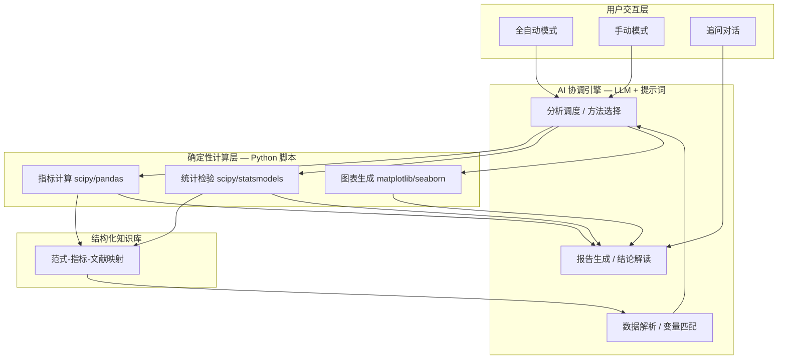

# EthoInsight PRD v2 (Draft)

> **版本**: V2.1 | **日期**: 2026-04-29 | **作者**: 曲若衡 | **状态**: 草案

---

## 1. 执行摘要

我们正在为 Noldus EthoVision 用户构建一个 AI 驱动的动物行为数据分析助手——EthoInsight。它面向每天跑实验的本科生、研究生和实验技术员，解决从"采集数据"到"理解数据"之间的专业鸿沟。用户上传 EthoVision 导出的行为数据，系统自动完成指标计算、统计检验、图表生成和结论解读，输出一份完整的分析报告。产品采用"手自一体"设计——本质上所有分析由确定性计算脚本完成（确保可复现性），AI 负责数据连接、变量匹配和结论解读；但用户可选择全自动模式（一键出报告）或手动模式（自行选择检验方法和图表类型，实际操作仍由脚本执行）。MVP 覆盖 6 种行为范式（4 种焦虑样行为 + 2 种抑郁样行为），预期将研究人员的数据分析时间从 4-5 小时压缩至 5 分钟以内，同时提升 Noldus 在项目竞标中的整体竞争力。

---

## 2. 问题陈述

### 谁遇到了这个问题？

使用 Noldus EthoVision 等行为追踪系统进行动物实验的**一线研究人员**——包括本科生、研究生和实验技术员。他们是每天操作设备、采集数据的人，但往往缺乏系统的数据分析和统计学训练。

### 问题是什么？

从采集数据到得出结论之间存在一道**专业鸿沟**。EthoVision 精确记录了动物的运动轨迹、速度、区域停留时间等原始数据，但"数据"不等于"洞察"。研究人员面对导出的 Excel 表格，需要：

1. **知道该看哪些指标** — 一种范式可能涉及 10+ 个测量指标，哪些对当前研究问题最关键？
2. **选择正确的统计方法** — t 检验还是 Mann-Whitney？ANOVA 还是 Kruskal-Wallis？需要先做正态性检验吗？
3. **判断结果是否正常** — 实验组和对照组相比，差异是否显著？效应量大不大？这个变化方向意味着什么？
4. **把多个指标综合起来解读** — 焦虑水平不只是看一个指标，需要综合多个维度的结果
5. **生成可用于发表的报告** — 出版级别的统计图表、规范的统计报告格式

### 为什么痛苦？

- **时间成本**：一个熟练的研究者完成从数据导出到分析报告需要 4-5 小时；新手可能需要 1-2 天
- **质量风险**：统计分析方法选择错误、指标解读偏差，直接影响实验结论的可靠性
- **重复劳动**：每次换一种实验范式，就需要重新学习一套分析方法
- **知识断层**：资深 PI 能凭经验快速解读数据，但这种经验无法有效传递给新手

### 证据

- **用户场景**：Noldus 技术支持团队日常接到大量"如何分析数据"的咨询（来源：技术支持团队反馈）
- **市场调研**：动物行为学研究中，数据分析是研究生阶段最常被提及的技能瓶颈
- **竞品现状**：GraphPad Prism、SPSS 等通用统计工具需要用户自行选择分析方法，无法提供领域专业解读

---

## 3. 目标用户与画像

### 主要画像：实验技术员小王

- **角色**: 大学实验室实验技术员 / 研究生
- **背景**: 生物学或心理学本科或硕士在读，能熟练操作 EthoVision 采集数据
- **统计学水平**: 知道 t 检验和 ANOVA 的概念，但不确定什么时候用哪个
- **行为学知识**: 了解自己正在做的实验范式的基本原理，但不确定指标该怎么解读
- **日常痛点**: 导出数据后花大量时间查文献确认分析方法、查阈值、手动做图
- **期望**: "我只想知道处理有没有效，告诉我结果就行"
- **使用模式**: 全自动模式为主（上传数据 → 直接看结论）

### 次要画像：有经验的研究员李同学

- **角色**: 课题组研究生（高年级硕士或博士），同时负责多个实验项目
- **背景**: 有 2-3 年行为学实验经验，理解实验设计和基本统计原理
- **统计学水平**: 能独立选择常用统计方法，对效应量和多重比较有基本认识
- **行为学知识**: 对自己研究的范式有较深入理解，但涉及跨范式分析时需要参考
- **日常痛点**: 需要快速处理大量数据，手动分析效率低；跨范式综合分析耗时
- **期望**: "帮我快速出初稿，我要能调整参数和图表样式"
- **使用模式**: 手动模式为主（选择检验方法、调整图表，但计算由系统完成）

### 第三画像：课题组长张教授

- **角色**: PI（Principal Investigator），负责研究方向的规划和论文把关
- **场景**: 不直接使用系统，但需要审阅分析报告的质量
- **需求**: 报告规范、结论可靠、图表达到发表水平
- **价值**: EthoInsight 提升了课题组整体的数据分析效率和质量

### 核心任务场景

| 任务场景 | 用户 | 场景 |
|------|------|------|
| "帮我判断处理是否有效" | 小王 | 跑完实验后，需要快速知道结果 |
| "帮我出一份合格的分析报告" | 小王 | 向 PI 汇报或写论文初稿 |
| "帮我批量处理多组数据" | 李同学 | 同时进行多个实验，需要高效出结果 |
| "帮我做跨范式的综合分析" | 李同学 | 同一批动物做了多个行为测试 |
| "帮我确保统计分析方法正确" | 所有人 | 不确定该用哪种检验时 |

---

## 4. 战略背景

### 商业目标

**主要目标：增强 Noldus 在项目竞标中的整体竞争力。** 当前，主流竞争对手已普遍配备自动化报告输出功能——广东一湾（BayONE）的 BehaviorAtlas 系列产品集成了从数据采集、AI姿态识别到行为分析的完整流水线，其 Analyzer 和 Explorer 软件已能提供可视化和导出功能；ANY-maze 也内置了基础的统计分析与报告生成能力。在这一竞争格局下，单纯依靠硬件性能已不足以在竞标中建立压倒性优势。EthoInsight 作为 EthoVision 硬件系统的配套分析能力，将 Noldus 的价值主张从"精确的数据采集"扩展到"从数据到洞察的端到端解决方案"——不仅要补齐报告输出这一短板，更要以 AI 驱动的自动化分析和领域知识编码能力建立差异化壁垒。在学术机构和药企的设备采购竞标中，具备 AI 分析能力的完整方案将成为关键竞争优势。

**次要目标：创造增值收入。** 作为 EthoVision 的可选增值模块（SaaS 订阅或一次性授权），提供持续收入来源。

### 为什么是现在？

- **AI 技术成熟**：LLM 在结构化报告生成和多轮对话方面已达到实用水平
- **市场竞争加剧**：竞争对手（如 CleverSys、ANY-maze）正在加强数据分析功能
- **客户需求变化**：研究机构越来越期望设备厂商提供"一站式"解决方案
- **知识资产变现**：Noldus 数十年积累的行为学专业知识需要数字化和产品化

### 竞争格局

| 竞品 | 定位 | 弱点 |
|------|------|------|
| 广东一湾 BehaviorAtlas / EthoClaw / EthoAnalysis | 国内 3D-AI 行为分析系统，集成采集+AI姿态识别+分析；EthoClaw 已率先推出针对传统行为范式的自动化分析 Skills | 国内品牌，国际市场认知度有限；已形成先发优势，需加速跟进 |
| ANY-maze | 行为分析软件，内置统计与报告 | 分析能力偏基础，无 AI 洞察和领域知识库 |
| GraphPad Prism | 通用统计分析 | 无行为学领域知识，用户需自行选择方法 |
| EthoVision 内置分析 | 基础统计导出 | 仅提供描述性统计，无深度分析和结论解读 |
| R/Python + 自定义脚本 | 完全定制 | 需要编程能力，无法推广给普通用户 |

**EthoInsight 的差异化**：不是又一个统计工具，而是将 Noldus 数十年的行为学领域知识编码为结构化知识库，由 AI 自动应用到每一次分析中。广东一湾的 EthoClaw 已率先推出针对传统范式的自动化分析 Skills，建立了先发优势——EthoInsight 需要以更深厚的领域知识编码（Noldus 几十年的行为学专业积累）和更强的分析深度（统计方法选择、指标方向解读、运动混杂检查、跨范式综合）来建立差异化壁垒。

---

## 5. 方案概述

### 5.1 核心架构

EthoInsight 采用"手自一体"的 AI Agent 架构，分为三个层次：

> **架构关键原则**：
> - **LLM 的边界**：AI 仅负责数据解析、变量匹配、方法选择和报告文本生成。所有数值计算（指标计算、统计检验、效应量）均由确定性 Python 脚本完成，LLM 不参与任何数值计算。
> - **可复现性与可追溯**：每次分析使用的计算脚本版本号与数据成对保存，确保同一数据在任何时间、由任何人执行都能得到完全一致的结果。
 分析报告附带脚本版本和执行日志，可查可审计。

### 5.2 "手自一体"运行机制

**全自动模式**：
1. 用户上传数据文件 → 2. AI 识别实验范式和数据结构 → 3. 自动选择所有关键指标 → 4. 自动选择统计方法 → 5. 执行计算 → 6. 生成完整报告

**手动模式**：
1. 用户上传数据文件 → 2. AI 识别实验范式和数据结构 → 3. 展示可选指标列表，用户勾选 → 4. 展示可选统计方法（附带推荐），用户选择 → 5. 用户选择图表类型 → 6. 执行计算 → 7. 生成报告

> **关键设计原则**：手动模式下，用户的"选择"本质上是修改后台提示词参数，所有计算仍由确定性脚本完成。这确保了：用户体验到操控感，同时结果的可复现性不受影响。

### 5.3 核心功能模块

#### 模块 A：数据导入与解析
- 支持 EthoVision 导出的 CSV/Excel 格式（用户手动导入）
- AI 自动识别实验范式类型（基于列名和数据结构）
- 智能变量匹配：将用户的原始数据列映射到标准指标名
- 数据质量检查：缺失值检测、异常值标记、样本量评估

#### 模块 B：分析与计算引擎
- 基于结构化知识库的指标计算（每种范式的核心指标公式）
- 统计检验自动选择（正态性检验 → 参数/非参数检验选择）
- 效应量计算（Cohen's d, η²）
- 多重比较校正（Bonferroni, FDR）
- 基于组间比较结果的焦虑/抑郁样行为指标方向解读

#### 模块 C：可视化生成
- 出版级统计图表（柱状图+散点、箱线图、雷达图等）
- 范式特异性图表（轨迹热图、区域分布图等，视数据可用性）
- 图表样式符合学术出版规范

#### 模块 D：报告生成与追问
- 自然语言分析报告（摘要、方法、结果、结论）
- 基于组间比较的指标解读，变化方向和行为学意义
- 支持多轮追问："第三组为什么异常？"、"能看看它们的轨迹图吗？"
- 报告导出（PDF/Word）

### 5.4 MVP 覆盖的 6 种行为范式

#### 焦虑样行为（4 种）

| 范式 | 核心指标 | 指标变化方向解读 |
|------|---------|------------------|
| 高架十字迷宫 (EPM) | 开臂时间%、开臂进入%、总进臂次数 | 开臂↓ 提示焦虑样行为↑；总进臂↓ 提示运动抑制 |
| 旷场实验 (OF) | 中心时间%、中心距离%、总距离、直立次数 | 中心区↓ 提示焦虑样行为↑；总距离↓ 提示运动抑制 |
| O迷宫 (Zero Maze) | 开放区时间%、犹豫次数 | 开放区↓ 提示焦虑样行为↑ |
| 明暗箱 (LDB) | 明箱时间%、穿梭次数、潜伏期 | 明箱↓ 提示焦虑样行为↑ |

#### 抑郁样行为（2 种）

| 范式 | 核心指标 | 指标变化方向解读 |
|------|---------|------------------|
| 悬尾实验 (TST) | 累计不动时间、不动潜伏期 | 不动↑ 提示抑郁样行为↑ |
| 强迫游泳 (FST) | 累计不动时间、不动潜伏期 | 不动↑ 提示抑郁样行为↑ |

> **参考品系**: C57BL/6J 成年雄性小鼠，标准化实验条件。各指标的解读基于组间统计比较结果，文献来源用于支持指标方向解读的合理性（详见附录 A）。

---

## 6. 成功指标

### 核心指标
**分析效率提升** — 从数据上传到获得完整分析报告的时间
- **当前基线**：4-5 小时（手动分析）
- **MVP 目标**：< 5 分钟（全自动模式）
- **测量方式**：系统记录的时间戳

### 辅助指标

| 指标 | 基线 | 目标 | 说明 |
|------|------|------|------|
| 分析完成率 | N/A | > 90% | 用户上传数据后成功生成完整报告的比例 |
| 用户满意度 (NPS) | N/A | > 40 | 首批用户调研 |
| 竞标提及率 | 0% | > 30% | 销售团队在竞标中提及 EthoInsight 的比例 |
| 手动模式使用率 | N/A | 监测 | 了解高级用户的模式偏好 |

### 护栏指标

| 指标 | 说明 |
|------|------|
| 计算结果一致性 | 同一数据多次分析，结果必须完全一致（确定性计算） |
| 分析准确率 | 知识库编码的指标方向解读规则和运动混杂检查逻辑必须与文献一致 |
| 系统可用性 | 核心功能可用性 ≥ 99.5% |

---

## 7. 用户故事与需求

### 史诗假设

我们相信，为使用 EthoVision 的一线研究人员提供一个"手自一体"的 AI 分析助手，将把数据分析时间从 4-5 小时压缩至 5 分钟以内，因为当前的时间消耗主要发生在方法选择、手动计算和报告撰写上，而非理解结果本身。

### 用户故事

**Epic 1: 数据导入与解析**

> **US-1.1**: 作为实验技术员，我希望上传 EthoVision 导出的 CSV/Excel 文件后，系统自动识别实验类型和数据结构，这样我不需要手动配置任何参数。
>
> 验收标准:
> - [ ] 支持上传 .csv 和 .xlsx 格式文件
> - [ ] 系统基于列名模式匹配，自动识别 6 种范式之一
> - [ ] 识别失败时给出明确的提示和手动选择选项
> - [ ] 单文件最大支持 10,000 行数据

> **US-1.2**: 作为实验技术员，我希望系统自动检测数据质量问题（缺失值、异常值、样本量不足），这样我能知道数据是否可靠。
>
> 验收标准:
> - [ ] 缺失值检测：标记缺失率 > 20% 的变量
> - [ ] 异常值检测：标记超过 3 SD 的数据点
> - [ ] 样本量检查：每组 < 5 个样本时给出警告
> - [ ] 在分析报告中包含数据质量摘要

**Epic 2: 分析与计算**

> **US-2.1**: 作为实验技术员（全自动模式），我希望一键获得完整的统计分析结果，包括正确的检验方法、效应量和显著性，这样我不需要自己选择统计方法。
>
> 验收标准:
> - [ ] 自动执行正态性检验（Shapiro-Wilk）
> - [ ] 根据正态性结果自动选择参数或非参数检验
> - [ ] 计算 effect size（Cohen's d 或 rank-biserial correlation）
> - [ ] 报告 p 值、效应量和置信区间

> **US-2.2**: 作为有经验的研究员（手动模式），我希望能在分析前选择指标和统计方法，同时系统给出推荐，这样我能保持对分析过程的控制。
>
> 验收标准:
> - [ ] 展示该范式下所有可用指标，标注推荐指标
> - [ ] 展示可选统计方法，标注系统推荐及原因
> - [ ] 用户的任何选择都不影响计算确定性（同样数据+同样选择=同样结果）
> - [ ] 手动模式下所有计算仍由确定性脚本完成

> **US-2.3**: 作为研究人员，我希望系统基于实验组与对照组的统计比较结果，结合领域知识对指标变化方向进行专业解读，这样我能理解数据的行为学意义。
>
> 验收标准:
> - [ ] 每个核心指标显示实验组 vs 对照组的比较结果，标注变化方向及其行为学含义
> - [ ] 指标方向解读附带支持性文献引用
> - [ ] 多指标综合评估时给出综合判断，结合运动混杂检查排除替代解释

**Epic 3: 可视化与报告**

> **US-3.1**: 作为研究人员，我希望系统自动生成出版级别的统计图表，这样我能直接用于论文和报告。
>
> 验收标准:
> - [ ] 默认生成：组间比较柱状图+散点叠加、效应量标注
> - [ ] 图表分辨率 ≥ 300 DPI
> - [ ] 配色方案支持色盲友好模式
> - [ ] 图表标题、轴标签、图例自动生成
> - [ ] 支持导出为 PNG/SVG 格式

> **US-3.2**: 作为研究人员，我希望获得一份自然语言的分析报告，包含方法、结果和结论，这样我能直接理解数据意味着什么。
>
> 验收标准:
> - [ ] 报告包含：实验概述、统计方法、数值结果、图表、指标解读、综合结论
> - [ ] 指标解读基于组间统计比较结果，说明变化方向和行为学意义
> - [ ] 结论区分"数据支持的发现"和"需要进一步验证的假设"
> - [ ] 支持中英文报告输出

> **US-3.3**: 作为研究人员，我希望能在报告基础上追问具体问题，这样我能深入理解特定结果。
>
> 验收标准:
> - [ ] 系统记住当前分析上下文，支持多轮对话
> - [ ] 可追问："第X组为什么异常？"、"能换一种检验方法吗？"、"帮我看看某个指标的趋势"
> - [ ] 追问产生的补充分析仍由确定性脚本完成
> - [ ] 对话历史可导出

**Epic 4: 范式支持**

> **US-4.1**: 作为研究人员，我希望系统能分析高架十字迷宫 (EPM) 实验数据，计算开臂时间%、开臂进入%、总进臂次数，并进行组间比较。
>
> 验收标准:
> - [ ] 支持识别标准 EPM 数据列名（openArmTime, openArmEntries, totalArmEntries 等）
> - [ ] 自动计算衍生指标（比例值）
> - [ ] 基于 Rodgers et al. (1997) 等文献支持指标方向解读（开臂指标降低提示焦虑样行为增加）
> - [ ] 检查运动混杂因素（总进臂次数过低时标记警告）

> **US-4.2**: 作为研究人员，我希望系统能分析旷场实验 (OF) 数据，计算中心时间%、中心距离%、总运动距离、直立次数，并进行组间比较。
>
> 验收标准:
> - [ ] 支持识别标准 OF 数据列名（centerTime, centerDistance, totalDistance, rearingCount 等）
> - [ ] 自动计算衍生指标（中心时间比例、中心距离比例）
> - [ ] 基于 Prut & Belzung (2003) 等文献支持指标方向解读（中心区指标降低提示焦虑样行为增加）
> - [ ] 区分焦虑效应与运动抑制（总距离过低时标记警告，提示可能为运动功能受损而非焦虑）

> **US-4.3**: 作为研究人员，我希望系统能分析 O迷宫 (Zero Maze) 数据，计算开放区时间%、犹豫次数，并进行组间比较。
>
> 验收标准:
> - [ ] 支持识别标准 O-Maze 数据列名（openQuadrantTime, hesitationCount, totalEntries 等）
> - [ ] 自动计算衍生指标（开放区时间比例）
> - [ ] 指标方向解读参考 EPM 类似指标（开放区指标降低提示焦虑样行为增加）
> - [ ] 犹豫次数作为辅助指标纳入综合评估

> **US-4.4**: 作为研究人员，我希望系统能分析明暗箱 (LDB) 数据，计算明箱时间%、穿梭次数、潜伏期，并进行组间比较。
>
> 验收标准:
> - [ ] 支持识别标准 LDB 数据列名（lightTime, transitionCount, latencyToLight 等）
> - [ ] 自动计算衍生指标（明箱时间比例）
> - [ ] 指标方向解读（明箱时间降低提示焦虑样行为增加）
> - [ ] 穿梭次数过低时标记探索动机不足警告

> **US-4.5**: 作为研究人员，我希望系统能分析悬尾实验 (TST) 数据，计算累计不动时间和不动潜伏期，并进行组间比较。
>
> 验收标准:
> - [ ] 支持识别标准 TST 数据列名（immobilityTime, immobilityLatency 等）
> - [ ] 累计不动时间作为核心抑郁样行为指标
> - [ ] 指标方向解读（不动时间较对照组增加提示抑郁样行为增加）
> - [ ] 不动潜伏期作为辅助指标（较对照组缩短提示快速放弃行为）

> **US-4.6**: 作为研究人员，我希望系统能分析强迫游泳 (FST) 数据，计算累计不动时间和不动潜伏期，并进行组间比较。
>
> 验收标准:
> - [ ] 支持识别标准 FST 数据列名（immobilityTime, immobilityLatency 等）
> - [ ] 累计不动时间作为核心抑郁样行为指标（注意 FST 与 TST 的解读各自独立）
> - [ ] 指标方向解读（不动时间较对照组增加提示抑郁样行为增加）
> - [ ] 区分不动、游泳、挣扎三种行为状态（如数据包含细分）

---

## 8. 范围排除

**MVP 不包含以下功能（及其原因）：**

| 排除项 | 原因 |
|--------|------|
| 跨范式关联分析 | 需要同一动物在多个范式中的配对数据，MVP 阶段数据支持不足 |
| AI 模型训练 / 预测模型 | 需要大量历史数据积累，MVP 专注基于规则的分析 |
| 学习与记忆类范式 (MWM, NOR 等) | 扩大至第二阶段，MVP 聚焦焦虑+抑郁 |
| 社交行为类范式 | 数据结构复杂，分析逻辑差异大，后续扩展 |
| 恐惧行为类范式 | 条件恐惧反射需要时间序列分析，复杂度较高 |
| 运动功能类范式 | 与焦虑/抑郁的关联较弱，优先级较低 |
| T-Pattern 行为序列分析 | 需要专门的时间序列分析引擎，独立开发 |
| 移动端适配 | 研究人员主要在桌面端使用，移动端延后 |
| 多用户协作 / 权限管理 | MVP 单用户场景，后续迭代 |
| 用户自定义范式 / 自定义指标 | 知识库标准化优先，开放自定义需更多验证 |
| 数据采集功能 | 与 EthoVision 定位不冲突，EthoInsight 只做分析 |
| 视频分析和轨迹回放 | 视频处理对计算资源要求高，延后至第二阶段 |

---

## 9. 依赖与风险

### 依赖项

| 依赖项 | 说明 | 状态 |
|--------|------|------|
| LLM 服务选型 | 开发调试和初期使用在线大模型 API（OpenAI/Claude），生产环境将部署微调后的本地小模型（单卡 GPU 即可运行） | 已决定 |
| 产品形态 | 开发期为 Web 应用；发售时使用 Electron 打包为桌面软件 | 已决定 |
| 后端技术栈 | FastAPI (Python) | 已决定 |
| 前端技术栈 | 待开发团队确认（React/Vue 等），需兼容 Electron 打包 | 待确认 |
| EthoVision 数据格式文档 | 需要确认所有支持的导出格式和列名规范 | 需协调 |
| 结构化知识库构建 | 6 种范式的指标方向解读规则、运动混杂检查规则、文献来源映射 | 待开发 |
| Docker 沙箱环境 | 代码执行隔离环境 | 待搭建 |
| UI/UX 设计 | 交互界面设计（全自动/手动模式切换） | 待启动 |

### 风险与缓解

| 风险 | 可能性 | 影响 | 缓解措施 |
|------|--------|------|----------|
| LLM 幻觉导致错误结论 | 中 | 高 | LLM 仅生成报告文本，所有数值来自确定性计算；报告中标注数据来源 |
| 知识库解读规则不准确 | 中 | 高 | 基于已发表文献编码指标方向解读规则；支持用户反馈纠正机制 |
| EthoVision 数据格式变化 | 低 | 中 | 建立列名映射规则库，支持模糊匹配 |
| 用户对 AI 分析结果不信任 | 中 | 中 | 提供"透明度面板"：展示每一步的方法选择依据和计算过程 |
| 手动模式的操控感不足 | 中 | 低 | 设计阶段进行用户测试，调整交互细节 |

---

## 10. 待决问题

1. **LLM 模型选型与微调**：开发调试期使用在线 API（OpenAI/Claude），生产环境将微调本地小模型，单卡 GPU 即可运行。需要评估：基座模型选择（Qwen/DeepSeek/Llama等）、微调数据集构建方案、推理框架选型（vLLM/TGI/Ollama等）
2. ~~**产品形态**~~：已决定 — 开发期 Web 应用，发售期 Electron 打包桌面软件
3. **数据存储**：Electron 桌面版是否本地存储所有数据？涉及数据隐私和合规
4. **多语言支持**：MVP 是否支持中英文双语界面和报告？
5. **定价策略**：免费增值、按次付费还是订阅制？
6. ~~**与 EthoVision 的集成深度**~~：已决定 — 完全独立产品。数据通过手动导入（CSV/Excel），后续可探索直接读取 EthoVision 数据库，但不影响产品独立性
7. **开放API**：是否允许第三方扩展分析范式？
8. **用户认证**：是否需要 Noldus 账号体系集成？

---

## 11. 发布计划

### 第一阶段：MVP（5/6 — 7/30，约 12 周）

**范围**: 6 种范式（4 焦虑 + 2 抑郁）的完整分析流水线

| 阶段 | 时间 | 关键目标 |
|------|------|----------|
| 框架上线 | 5/6 — 5/10 | 框架上线完成 |
| 模型对接 & 标准制定 | 5/10 — 5/20 | 模型微调对接；工程师标准制定 & 数据准备 |
| 数据飞轮 | 5/20 — 6/17 | 工程师数据飞轮运行；检查 log 和反馈，识别有效反馈 |
| 学生内测 | 6/17 — 7/30 | 浮动日期，以达成公测标准为准 |
| 公测 | 7/30 | 公测标准：所有预计支持范式的输出正确 |

> **公测标准：** 所有预计支持范式的输出是正确的（技术层面）。

### 第二阶段：扩展（7/30 — 9/10，约 6 周）

**范围**: 范式扩展 + 跨范式分析
- 新增学习与记忆类范式（MWM, NOR, Y-Maze 等）
- 个体综合行为档案（跨范式整合）
- 报告模板和导出格式增强
- 批量数据处理
- 公测问题修复与优化
- 产品宣传推广

| 阶段 | 时间 | 关键目标 |
|------|------|----------|
| 公测 + 扩展开发 | 7/30 — 8/23 | 公测进行中；并行开发扩展功能 |
| 调试 | 8/23 — 9/1 | 问题修复与优化 |
| 宣传 | 9/1 — 9/10 | 产品宣传推广 |
| 神经会 | 9/10 | semi-full function，各领域代表测试 |

> **神经会要求：** 不追求各领域完备，需具备各个领域的代表测试。

### 第三阶段：智能化（9/10 — 10/31，约 7 周）

**范围**: AI 增强功能
- 治疗响应预测
- 异常检测与预警
- 行为表型自动分类（聚类分析）
- 用户行为模式学习

| 阶段 | 时间 | 关键目标 |
|------|------|----------|
| AI 功能开发 | 9/10 — 10/20 | 智能化功能开发与测试 |
| v1.0 冻结 | 10/31 | v1.0 模型 & 技术冻结 |

### 第四阶段：生态化（11/1 — 12/31，约 2 个月）

**范围**: 平台化
- 全部 19+ 种范式支持
- 用户自定义分析流程
- 团队协作与权限管理
- API 开放与第三方集成

| 阶段 | 时间 | 关键目标 |
|------|------|----------|
| 生态功能开发 | 11/1 — 12/15 | 平台化功能开发与集成测试 |
| 正式发售 | 12/31 | 正式发售 |

---

## 12. 技术需求（概述）

| 层次 | 技术选型 | 说明 |
|------|---------|------|
| 前端 | 待定（React/Vue 等），Electron 打包 | 全自动/手动模式切换、报告展示、对话界面 |
| 后端 | FastAPI (Python) | 分析引擎、API 服务 |
| 分析引擎 | scipy, statsmodels, pandas, numpy | 确定性计算，确保可复现 |
| 可视化 | matplotlib, seaborn | 出版级图表生成 |
| AI 协调 | 开发期：在线 LLM API；生产期：微调本地小模型（单卡 GPU） | 数据解析、方法选择、报告生成 |
| 知识库 | YAML/JSON 结构化数据 | 范式-指标-方向解读-运动混杂检查-文献映射 |
| 代码执行 | Docker 沙箱 | 安全隔离 |
| 数据存储 | 待定 | 用户数据和分析结果存储 |
| 打包分发 | Electron | 发售时打包为桌面应用，本地运行 |

---

## 附录 A：6 种范式的核心指标详细定义

> 各指标的文献来源将在知识库构建阶段完成。本附录仅定义指标的计算方式和解读规则。

### 焦虑样行为指标定义

> 系统不对单个指标进行绝对阈值判定，而是进行**组间统计比较**。分析报告中的结论基于统计检验结果（如 p 值、效应量），而非绝对阈值切割。

> **关于运动混杂检查**：焦虑样行为指标（如开臂时间%、中心区时间%）的下降可能源于两种完全不同的原因——焦虑增加导致回避，或运动功能受损导致总体活动量下降。如果不加以区分，可能将"动物跑不动了"误判为"动物更焦虑了"。运动混杂检查通过同时观察总体活动指标（如总进臂次数、总运动距离），在总体活动量异常偏低时发出警告，提醒研究者该焦虑指标的下降可能存在运动功能受损的替代解释，需谨慎解读。

#### EPM (高架十字迷宫)
| 指标 | 英文名 | 计算方式 | 指标方向解读 | 运动混杂检查 |
|------|--------|---------|-------------|-------------|
| 开臂时间% | openArmTimeRatio | 开臂时间/总时间×100% | 数值↓ 与焦虑样行为正相关 | 总进臂次数 <8 时标记运动抑制 |
| 开臂进入% | openArmEntryRatio | 开臂进入次数/总进臂次数×100% | 数值↓ 与焦虑样行为正相关 | 同上 |
| 总进臂次数 | totalArmEntries | 直接测量 | 反映总体活动水平 | — |

#### OF (旷场实验)
| 指标 | 英文名 | 计算方式 | 指标方向解读 | 运动混杂检查 |
|------|--------|---------|-------------|-------------|
| 中心时间% | centerTimeRatio | 中心区时间/总时间×100% | 数值↓ 与焦虑样行为正相关 | 总距离 <1000cm 时标记运动抑制 |
| 中心距离% | centerDistanceRatio | 中心区距离/总距离×100% | 数值↓ 与焦虑样行为正相关 | 同上 |
| 总距离 | totalDistance | 直接测量 (cm) | 反映总体活动水平 | — |
| 直立次数 | rearingCount | 直接测量 | 探索行为指标，需结合总活动量解读 | — |

#### O-Maze (O迷宫)
| 指标 | 英文名 | 计算方式 | 指标方向解读 | 运动混杂检查 |
|------|--------|---------|-------------|-------------|
| 开放区时间% | openQuadrantTimeRatio | 开放区时间/总时间×100% | 数值↓ 与焦虑样行为正相关 | 总进区次数过低时标记 |
| 犹豫次数 | hesitationCount | 从封闭区探头后缩回的次数 | 数值↑ 与焦虑倾向正相关 | — |

#### LDB (明暗箱)
| 指标 | 英文名 | 计算方式 | 指标方向解读 | 运动混杂检查 |
|------|--------|---------|-------------|-------------|
| 明箱时间% | lightTimeRatio | 明箱时间/总时间×100% | 数值↓ 与焦虑样行为正相关 | 穿梭次数 <4 时标记探索动机低 |
| 穿梭次数 | transitionCount | 明暗箱之间穿梭的总次数 | 反映探索/回避平衡 | — |
| 潜伏期 | latencyToLight | 首次进入明箱的时间 (s) | 数值↑ 与回避行为正相关 | — |

### 抑郁样行为指标定义

#### TST (悬尾实验)
| 指标 | 英文名 | 计算方式 | 指标方向解读 | 备注 |
|------|--------|---------|-------------|------|
| 累计不动时间 | immobilityTime | 整个测试期间不动时间总和 (s) | 数值↑ 与抑郁样行为正相关 | 需排除运动能力差异 |
| 不动潜伏期 | immobilityLatency | 首次出现不动行为的时间 (s) | 数值↓ 与快速放弃行为正相关 | — |

#### FST (强迫游泳)
| 指标 | 英文名 | 计算方式 | 指标方向解读 | 备注 |
|------|--------|---------|-------------|------|
| 累计不动时间 | immobilityTime | 整个测试期间不动时间总和 (s) | 数值↑ 与抑郁样行为正相关 | 需排除游泳能力差异 |
| 不动潜伏期 | immobilityLatency | 首次出现不动行为的时间 (s) | 数值↓ 与快速放弃行为正相关 | — |

---

*文档结束*
