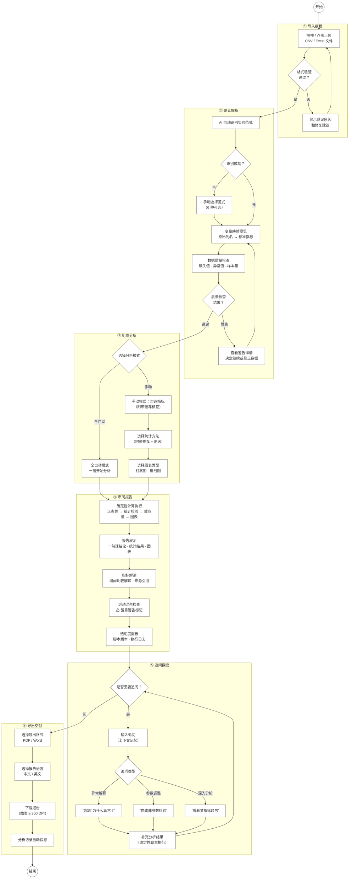

# EthoInsight 用户故事地图

> **版本**: V1 | **日期**: 2026-04-15 | **方法**: Jeff Patton Story Mapping | **状态**: 草案

---

## 上下文

**目标用户**: 使用 EthoVision 进行动物行为实验的研究生和实验技术员  
**叙事**: 用户上传 EthoVision 导出的行为数据，系统自动完成指标计算、统计检验、图表生成和结论解读，输出一份完整的分析报告——将数据分析时间从 4-5 小时压缩至 5 分钟以内

**用户画像**:
- **主要**：小王（研究生/技术员）—— 统计基础薄弱，期望"告诉我结果就行"，全自动模式为主
- **次要**：李同学（高年级博后）—— 有经验，期望"帮我快速出初稿，我要能调参数"，手动模式为主

---

## 软件使用流程图



---

## 骨干（Backbone）— 6 个核心活动

```
导入数据 → 确认解析 → 配置分析 → 审阅报告 → 追问探索 → 导出交付
```

---

## 完整故事地图

### 活动 1：导入数据

> 用户将 EthoVision 导出的数据文件上传到系统中。

| 步骤 | MVP（R1 必须） | R2（扩展） | R3+（未来） |
|------|---------------|-----------|------------|
| **1.1 选择文件** | 拖拽/点击上传 CSV/Excel | 支持批量上传多文件 | 直接读取 EthoVision 数据库 |
| **1.2 格式验证** | 基础格式检查（编码、行列结构） | EthoVision 全格式变体兼容 | 智能格式修复建议 |
| **1.3 上传处理** | 上传进度条 + 成功/失败反馈 | 大文件分片上传 | 断点续传 |

**MVP 任务清单：**
- [ ] 拖拽上传区域 + 点击选择按钮
- [ ] 支持 .csv 和 .xlsx 两种格式
- [ ] 文件大小限制（10,000 行）提示
- [ ] 上传进度实时显示
- [ ] 上传成功 → 自动进入解析阶段
- [ ] 上传失败 → 显示具体错误原因和修复建议

---

### 活动 2：确认解析

> AI 自动识别实验范式、解析数据结构、检查数据质量。用户确认或修正。

| 步骤 | MVP（R1 必须） | R2（扩展） | R3+（未来） |
|------|---------------|-----------|------------|
| **2.1 范式识别** | 基于列名自动识别 6 种范式 | 模糊匹配 + 置信度评分 | 自定义范式模板 |
| **2.2 变量映射** | 展示原始列名→标准指标的映射 | 可视化映射连线 + 手动修正 | 学习用户自定义列名 |
| **2.3 质量检查** | 缺失值/异常值/样本量三项检查 | 异常值上下文可视化 | 自动异常值处理策略推荐 |
| **2.4 数据预览** | 数据表格摘要（行列数、分组信息） | 交互式数据探索 | 数据分布可视化预览 |

**MVP 任务清单：**
- [ ] 基于列名模式匹配自动识别 6 种范式之一
- [ ] 识别结果卡片展示："检测到：高架十字迷宫 (EPM)"
- [ ] 识别失败 → 手动选择范式（下拉列表 6 选 1）
- [ ] 变量映射预览表（原始列名 ↔ 标准指标名）
- [ ] 缺失值检测：标记缺失率 > 20% 的变量
- [ ] 异常值检测：标记超过 3 SD 的数据点
- [ ] 样本量检查：每组 < 5 个样本时给出警告
- [ ] 数据质量摘要卡片（通过/警告/失败）
- [ ] 用户确认按钮 → 进入下一阶段

---

### 活动 3：配置分析

> 用户选择分析模式（全自动/手动），配置分析参数。

| 步骤 | MVP（R1 必须） | R2（扩展） | R3+（未来） |
|------|---------------|-----------|------------|
| **3.1 选择模式** | 全自动 / 手动模式切换 | 记住用户偏好 + 智能推荐模式 | 基于用户画像自动选模式 |
| **3.2 选择指标**（手动） | 可选指标列表 + 推荐标签 | 指标关联提示 + 依赖自动勾选 | 智能指标组合推荐 |
| **3.3 选择方法**（手动） | 可选统计方法 + 系统推荐及原因 | 方法对比预览 | 自定义分析流水线 |
| **3.4 选择图表**（手动） | 图表类型选择（柱状图/箱线图） | 图表预览缩略图 | 图表样式深度定制 |

**全自动路径（MVP 核心路径）：**
```
选择"全自动" → 一键开始 → 跳过 3.2-3.4 → 直接进入计算
```

**手动路径（MVP）：**
```
选择"手动" → 勾选指标（带推荐标签）→ 选择方法（带推荐+原因）→ 选择图表类型 → 开始分析
```

**MVP 任务清单：**
- [ ] 模式选择界面：两张卡片（全自动 / 手动），附简短描述
- [ ] 全自动模式：一键"开始分析"按钮
- [ ] 手动模式 - 指标列表：展示该范式所有可用指标，推荐指标打标签
- [ ] 手动模式 - 方法选择：展示可选统计方法，标注推荐及原因（如"推荐 Mann-Whitney U：样本量较小且正态性检验未通过"）
- [ ] 手动模式 - 图表选择：柱状图+散点 / 箱线图
- [ ] 手动模式 - "一键采纳推荐"快捷按钮
- [ ] 全自动模式的参数预览（可选展开查看系统将自动使用的配置）

---

### 活动 4：审阅报告

> 系统生成完整的分析报告，用户审阅统计结果、图表和结论。

| 步骤 | MVP（R1 必须） | R2（扩展） | R3+（未来） |
|------|---------------|-----------|------------|
| **4.1 查看计算进度** | 分步进度条（正态性检验→统计检验→效应量→图表） | 实时计算状态详情 | 预估剩余时间 |
| **4.2 阅读报告摘要** | 一句话结论 + 关键发现列表 | "PI 摘要页"单页视图 | 报告模板选择 |
| **4.3 查看统计结果** | 检验方法、p 值、效应量、置信区间 | 多组比较详细表格 | 交互式统计探索 |
| **4.4 查看图表** | 柱状图+散点叠加、效应量标注 | 多种图表类型切换、色盲友好模式 | 图表样式微调、SVG 导出 |
| **4.5 阅读指标解读** | 基于组间比较的指标方向解读 + 文献引用 | 指标趋势跨实验对比 | 品系特异性参考库 |
| **4.6 查看综合结论** | 综合判断 + 置信度 + 运动混杂检查 | 跨范式综合评估 | 治疗响应预测 |
| **4.7 查看透明度信息** | 脚本版本号 + 执行日志（可展开） | 计算过程可视化回放 | 方法论白皮书链接 |

**MVP 任务清单：**
- [ ] 计算进度分步显示：正态性检验 ✓ → 统计检验 ✓ → 效应量计算 ✓ → 图表生成中...
- [ ] 报告结构化展示：实验概述 → 统计方法 → 数值结果 → 图表 → 指标解读 → 综合结论
- [ ] 一句话结论优先展示（如"实验组相比对照组表现出显著的焦虑样行为增加"）
- [ ] 统计结果卡片：检验方法、p 值、效应量、置信区间
- [ ] 出版级图表：柱状图+散点叠加，分辨率 ≥ 300 DPI
- [ ] 指标解读卡片：基于组间比较的指标方向解读（变化方向 + 行为学意义）+ 文献来源
- [ ] 运动混杂检查结果（醒目标记，如"⚠ 总进臂次数偏低，可能存在运动抑制"）
- [ ] 结论区分"数据支持的发现"和"需要进一步验证的假设"
- [ ] 透明度面板（可展开）：脚本版本号、执行日志、方法选择依据
- [ ] 中英文报告支持

---

### 活动 5：追问探索

> 用户基于报告进行多轮追问，深入理解特定结果或调整分析。

| 步骤 | MVP（R1 必须） | R2（扩展） | R3+（未来） |
|------|---------------|-----------|------------|
| **5.1 提出问题** | 聊天式追问输入框 | 追问建议标签 + 快捷模板 | 语音追问 |
| **5.2 获取补充分析** | 追问产生的分析由确定性脚本完成 | 分析变更自动同步报告 | 智能追问推荐链 |
| **5.3 调整参数** | 换检验方法、换图表类型 | 参数调整 A/B 对比 | 自动参数优化建议 |
| **5.4 管理对话** | 对话历史记录 | 对话历史导出 | 对话分支管理 |

**MVP 任务清单：**
- [ ] 追问对话框（聊天式界面，位于报告下方或侧边）
- [ ] 系统记住当前分析上下文，支持多轮对话
- [ ] 追问建议标签（如"查看效应量详情"、"第 3 组为什么异常？"）
- [ ] 追问产生的补充分析仍由确定性脚本完成（非 LLM 生成）
- [ ] 对话历史可折叠/展开
- [ ] 典型追问支持：
  - "第 X 组为什么异常？"
  - "能换成 Mann-Whitney 检验吗？"
  - "帮我看看某个指标的趋势"

---

### 活动 6：导出交付

> 用户将报告导出为可分享的文件，交给 PI 或用于论文。

| 步骤 | MVP（R1 必须） | R2（扩展） | R3+（未来） |
|------|---------------|-----------|------------|
| **6.1 选择格式** | PDF / Word 导出 | PPT 格式、LaTeX 格式 | 图表单独 PNG/SVG 导出 |
| **6.2 选择范围** | 完整报告导出 | 仅图表 / 仅统计结果 / 自定义范围 | 报告模板选择 |
| **6.3 导出下载** | 下载文件 + 完成提示 | 导出前预览 | 邮件直接发送 |
| **6.4 存档记录** | 分析记录保存到本地 | 历史分析列表 + 搜索 | 团队共享空间 |

**MVP 任务清单：**
- [ ] 导出格式选择：PDF / Word
- [ ] 完整报告导出（包含图表、统计结果、文献引用）
- [ ] 报告语言选择（中文 / 英文）
- [ ] 下载进度 + 完成提示
- [ ] 分析记录自动保存（数据文件 + 参数配置 + 结果）
- [ ] 图表分辨率 ≥ 300 DPI（出版标准）

---

## 发布切片（Release Slices）

### ═══ MVP（R1）— 第一条水平线 ═══

**时间**: 5/6 — 7/30（约 12 周）
**目标**：6 种范式完整分析流水线，全自动 + 手动两种模式

```
| 活动 | MVP 包含内容 |
|------|-------------|
| 导入数据 | CSV/Excel 上传、格式验证、进度反馈 |
| 确认解析 | 范式自动识别（6 种）、变量映射、质量检查 |
| 配置分析 | 全自动一键分析 + 手动指标/方法/图表选择 |
| 审阅报告 | 结构化报告、统计结果、图表、指标解读、结论、透明度面板 |
| 追问探索 | 聊天式追问、上下文记忆、追问建议 |
| 导出交付 | PDF/Word 导出、中英文、分析记录保存 |
```

**MVP 不包含：**
- ❌ 批量上传
- ❌ 跨范式分析
- ❌ 图表样式微调
- ❌ 自定义范式
- ❌ 多用户协作
- ❌ 直接读取 EthoVision 数据库

---

### ═══ R2（扩展）— 第二条水平线 ═══

**时间**: 7/30 — 9/10（约 6 周）
**目标**：范式扩展 + 效率提升 + 体验打磨 → 神经会 semi-full function

```
| 活动 | R2 新增内容 |
|------|------------|
| 导入数据 | 批量上传、全格式兼容 |
| 确认解析 | 模糊匹配置信度、映射可视化 |
| 配置分析 | 记住偏好、指标关联提示、图表预览 |
| 审阅报告 | 图表类型切换、色盲友好模式、"PI 摘要页" |
| 追问探索 | 追问快捷模板、分析变更同步报告 |
| 导出交付 | PPT 格式、图表单独导出、历史分析列表 |
| **新增** | **学习记忆类范式（MWM, NOR, Y-Maze）** |
| **新增** | **个体综合行为档案（跨范式整合）** |
| **新增** | **批量数据处理** |
```

---

### ═══ R3（智能化）— 第三条水平线 ═══

**时间**: 9/10 — 10/31（约 7 周）
**目标**：AI 增强功能 → v1.0 技术冻结

```
| 活动 | R3 新增内容 |
|------|------------|
| 确认解析 | 智能格式修复、自定义范式模板 |
| 配置分析 | 智能模式推荐、自定义分析流水线 |
| 审阅报告 | 图表样式深度定制、治疗响应预测、异常检测 |
| 追问探索 | 智能追问推荐链 |
| **新增** | **行为表型自动分类（聚类分析）** |
| **新增** | **用户行为模式学习** |
```

---

### ═══ R4（生态化）— 第四条水平线 ═══

**时间**: 11/1 — 12/31（约 2 个月）
**目标**：平台化 → 正式发售

```
| 活动 | R4 新增内容 |
|------|------------|
| 导入数据 | 直接读取 EthoVision 数据库 |
| 确认解析 | 学习用户自定义列名 |
| 导出交付 | 团队共享空间、邮件发送 |
| **新增** | **全 19+ 种范式支持** |
| **新增** | **团队协作与权限管理** |
| **新增** | **API 开放与第三方集成** |
```

---

## 范式支持矩阵（MVP）

| 范式 | 核心指标 | 自动识别 | 运动混杂检查 | 优先级 |
|------|---------|---------|-------------|--------|
| **EPM** 高架十字迷宫 | 开臂时间%、开臂进入%、总进臂次数 | ✓ | 总进臂 < 8 → 警告 | P0 |
| **OF** 旷场实验 | 中心时间%、中心距离%、总距离、直立次数 | ✓ | 总距离 < 1000cm → 警告 | P0 |
| **O-Maze** O迷宫 | 开放区时间%、犹豫次数 | ✓ | 总进区过低 → 警告 | P0 |
| **LDB** 明暗箱 | 明箱时间%、穿梭次数、潜伏期 | ✓ | 穿梭 < 4 → 警告 | P0 |
| **TST** 悬尾实验 | 累计不动时间、不动潜伏期 | ✓ | 排除运动能力差异 | P0 |
| **FST** 强迫游泳 | 累计不动时间、不动潜伏期 | ✓ | 排除游泳能力差异 | P0 |

---

## MVP 关键路径（Happy Path）

**全自动模式 — 小王的典型路径（目标 < 5 分钟）：**

```
1. 拖拽 CSV 文件到上传区域                          ~10s
2. 系统自动识别："检测到：EPM 高架十字迷宫"           ~5s
3. 小王看了一眼质量检查：全部通过，点击"确认"          ~15s
4. 选择"全自动模式"，点击"开始分析"                  ~5s
5. 等待计算完成（进度条走完）                         ~30s
6. 阅读一句话结论 + 浏览图表                         ~60s
7. 点击"导出 PDF"                                   ~10s
   ────────────────────────────────────────────
   总计：约 2.5 分钟 ✅
```

**手动模式 — 李同学的典型路径（目标 < 8 分钟）：**

```
1. 上传 Excel 文件                                  ~15s
2. 系统识别 OF，李同学确认并修正一个映射              ~30s
3. 选择"手动模式"                                   ~5s
4. 勾选指标（采纳推荐 + 额外选直立次数）              ~30s
5. 选择统计方法（看到推荐 Mann-Whitney，采纳）         ~20s
6. 选择箱线图 + 柱状图散点叠加                        ~15s
7. 点击"开始分析"                                    ~5s
8. 等待计算完成                                      ~30s
9. 审阅报告，追问"中心距离%的趋势"                    ~60s
10. 调整图表配色                                     ~30s
11. 导出 Word + 图表单独 PNG                          ~15s
    ─────────────────────────────────────────────
    总计：约 4.5 分钟 ✅
```

---

## 差距与机会识别

### 已识别的差距

| 差距 | 说明 | 建议 |
|------|------|------|
| **首次体验空白** | 新用户打开软件后没有引导 | MVP 增加首次使用 3 步引导或示例数据体验 |
| **模式选择决策点** | 新手可能不确定选哪个模式 | 全自动作为默认推荐，手动标注"高级" |
| **追问边界** | 用户不清楚可以问什么 | 提供追问建议标签 + 常见问题模板 |
| **PI 视角缺失** | 报告面向操作者，PI 审阅需求未专门设计 | R2 增加"PI 摘要页" |
| **品系覆盖** | MVP 仅 C57BL/6J 阈值 | R2 扩展品系特异性阈值库 |

### 潜在的愉悦时刻

| 时刻 | 设计建议 |
|------|---------|
| 范式自动识别成功 | 展示识别动画 + 置信度，给用户"被理解"的惊喜 |
| 首份报告生成 | 报告顶部显示"分析完成！耗时 2 分 30 秒——比手动分析节省了 4.5 小时" |
| 追问即时响应 | 补充分析在 5 秒内完成，展示"已基于确定性脚本完成补充分析" |
| 导出成功 | 显示报告文件大小和页数预览，给用户"专业感" |
