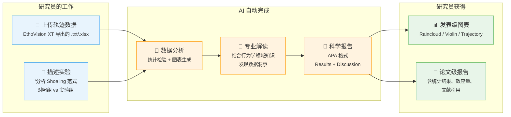
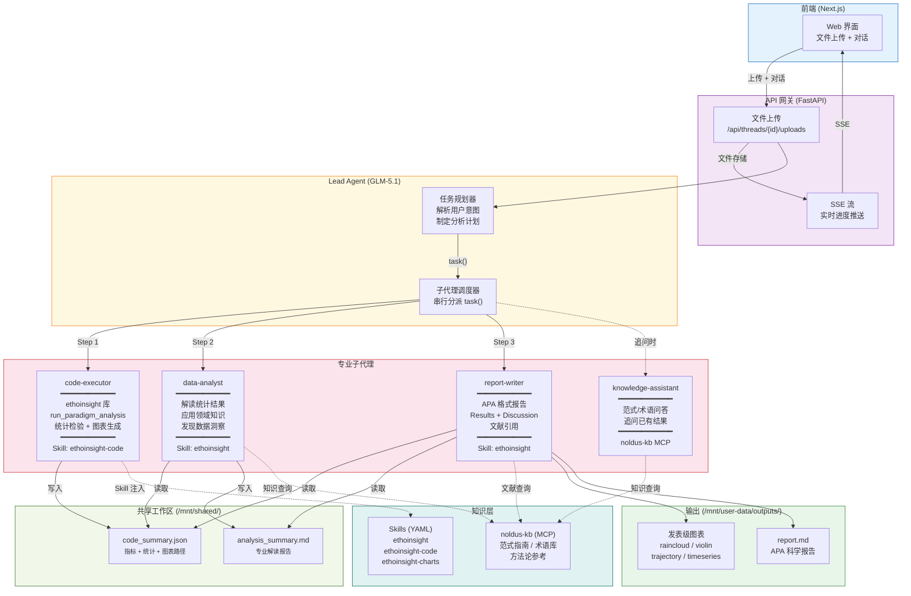

# EthoInsight — 行为学洞察的 AI Agent 架构

> ⚠️ **2026-04-29 注意**：本文档下方"数据流水线详解"中范式表示为单字段 `paradigm=shoaling`。
> 实际正在迁移到 EV19 模板 + 学术范式双字段（`ev19_template` + `paradigm`）。
> 详见 [docs/plans/2026-04-29-ev19-template-paradigm-design.md](plans/2026-04-29-ev19-template-paradigm-design.md)。
> 流水线本身不变，只是 Gate 1（任务规划之前）的范式确认机制改造。

## 上层：价值视角（给非技术人员看）

> **一句话**：研究员上传 EthoVision XT 导出的轨迹数据，AI 自动完成统计分析、专业解读、科学报告撰写。从数据到论文级报告，全程无需写代码。



### 传统方式 vs EthoInsight

| | 传统方式 | EthoInsight |
|---|---|---|
| **分析时间** | 数小时（手动写 Python/R 脚本） | 几分钟（AI 自动执行） |
| **统计专业度** | 取决于研究员统计功底 | 自动选择正确的检验方法 |
| **图表质量** | 需要 matplotlib/ggplot 经验 | 一键生成发表级图表 |
| **领域知识** | 需要翻阅文献查参考范围 | 内置 Noldus 行为学知识库 |
| **报告撰写** | 手动撰写，格式不统一 | APA 格式，含效应量和文献引用 |
| **可重复性** | 依赖个人脚本 | 标准化流水线，结果可复现 |

---

## 下层：技术架构（给技术人员看）



### 数据流水线详解

```
用户上传 5 个轨迹文件 + "分析 Shoaling 行为，对照组 vs 实验组"
         │
         ▼
   ┌─────────────┐
   │  Lead Agent  │  GLM-5.1，Plan Mode
   │  任务规划     │  解析: paradigm=shoaling, groups=[control, treatment]
   └──────┬──────┘
          │ task(code-executor, "分析 Shoaling 数据...")
          ▼
   ┌─────────────────────────────────────────────────┐
   │  code-executor                                   │
   │  1. run_paradigm_analysis(                       │
   │       paradigm="shoaling",                       │
   │       file_pattern="轨迹-*.txt",                 │
   │       groups={"control": [...], "treatment": [...]│
   │     )                                            │
   │  2. 自动: 解析数据 → 正态性检验 → 选择统计方法    │
   │     → Mann-Whitney U / t-test → Cohen's d        │
   │  3. 输出: code_summary.json + 8 种图表           │
   │  → 写入 /mnt/shared/code_summary.json            │
   └──────┬──────────────────────────────────────────┘
          │ task(data-analyst, "解读分析结果...")
          ▼
   ┌─────────────────────────────────────────────────┐
   │  data-analyst                                    │
   │  1. 读取 code_summary.json                       │
   │  2. 查询 noldus-kb: Shoaling 范式正常范围        │
   │  3. 解读: 组间差异的生物学意义                    │
   │  4. 发现洞察: 哪些指标有实际意义 (d > 0.5)       │
   │  → 写入 /mnt/shared/analysis_summary.md          │
   └──────┬──────────────────────────────────────────┘
          │ task(report-writer, "撰写科学报告...")
          ▼
   ┌─────────────────────────────────────────────────┐
   │  report-writer                                   │
   │  1. 读取 code_summary.json + analysis_summary.md │
   │  2. 查询 noldus-kb: 相关文献引用                 │
   │  3. 撰写 APA 格式报告:                           │
   │     - Results: 统计结果 + 效应量 + 图表引用      │
   │     - Discussion: 解读 + 文献对比 + 局限性        │
   │  → 输出 /mnt/user-data/outputs/report.md         │
   └─────────────────────────────────────────────────┘
```

### 关键设计决策

| 决策 | 选择 | 原因 |
|------|------|------|
| **Agent 架构** | Lead + 4 专业子代理 | 每个子代理专注一件事，prompt 精准，质量可控 |
| **LLM** | GLM-5.1 (智谱) | 国内部署，中文行为学语料强，延迟低 |
| **知识注入** | Skill (YAML) + MCP (noldus-kb) | Skill 注入静态方法论，MCP 查询动态知识库 |
| **子代理协作** | 共享文件系统 (/mnt/shared/) | JSON 文件传递结构化数据，简单可靠 |
| **统计分析** | ethoinsight Python 库 | 封装统计决策树，避免 LLM 选错检验方法 |
| **图表** | 8 种预定义图表类型 | 发表级质量，300 DPI，覆盖行为学常见需求 |

### 为什么是 Agent 而不是传统软件？

传统的行为分析软件（包括 EthoVision XT 本身）是**确定性流水线**：固定输入 → 固定输出。

Agent 架构带来三个本质变化：

1. **自然语言交互**：研究员用中文描述实验意图，不需要学 Python 或 R。
2. **领域知识推理**：data-analyst 不只是跑统计，它理解"Shoaling 行为中 Inter-Individual Distance 下降意味着什么"，能发现研究员可能忽略的洞察。
3. **追问与迭代**：分析完成后，研究员可以追问"为什么对照组的速度方差这么大？"，knowledge-assistant 结合已有数据和领域知识给出解释。

这不是"AI 替代研究员"，而是"AI 成为研究员的分析助手"。研究员专注于实验设计和科学判断，AI 处理繁琐的数据处理、统计选择和报告撰写。
