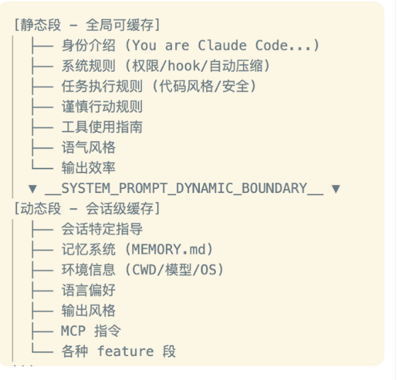

# 从claude code源码中， 我们需要学到什么
## 提示词缓存
prompt cache，我认为是会极大增强用户体验和agent能力的一个方面。
首先你需要判断，现在这个deerflow在处理长上下文时，是不是还是简单拼粗暴拼接system prompt和历史对话。
你需要做的是学习claude code， 提示词组装要做的很好。学习这个文件：/home/qiuyangwang/claude-code-source-code/src/services/api/claude.ts
为了最大化缓存命中率，Claude Code 设计了严密的分段缓存架构：
静态段（全局可缓存）：通过 systemPromptSection() 生成，包含模型身份介绍（"You are Claude Code..."）、系统级安全规则、代码风格限制、工具使用基础指南等。这部分在整个会话生命周期内几乎不变。
动态分界线：源码中硬编码了一个特殊标记 SYSTEM_PROMPT_DYNAMIC_BOUNDARY。
动态段（会话级缓存/不缓存）：包含当前工作目录信息（CWD）、Git 状态、MCP（Model Context Protocol）指令、用户配置等高频变化的数据。

并且为了防止 Prompt 发生微小变化导致缓存穿透，系统做了大量看似繁琐的兜底工作：
确定性排序：传给大模型的工具描述（Tools Description）被严格按照内置工具前缀 + MCP 工具后缀进行字母表排序。
哈希路径映射：配置文件的路径不使用随机 UUID，而是使用基于内容的哈希值，避免每次注入路径不同破坏缓存。
状态外置：甚至连当前可用的 Agent 列表，也被从工具描述中剥离，转移到了消息附件（Attachments）中。据源码注释透露，仅这一项改动就减少了约 10.2% 的 Cache Creation Tokens 消耗。

## Tools与流式并发执行
Claude Code 内置了超过 40 种工具（涵盖文件读写、Bash 执行、网络抓取等），其工具系统架构采用了高度模块化的工厂模式（Factory Pattern）。
每个工具继承自基础的 Tool 接口，必须实现诸如 checkPermissions()、validateInput() 和 isConcurrencySafe()（是否并发安全）等方法。
按需加载的 ToolSearch 机制：当工具数量超过某个阈值时，如果把所有工具的描述都塞进 Prompt，Token 成本将不可接受。
源码中展示了一种名为 ToolSearch 的优雅策略：非核心工具（如某些特定的分析插件）被标记为 defer_loading: true。
模型在当前 Prompt 中看不到这些工具的具体定义，只知道有一个 ToolSearch 工具。当模型认为自己需要额外能力时，必须先调用 ToolSearch 去动态加载对应的工具配置。
StreamingToolExecutor（流式工具执行器）：为了提升执行效率，系统支持工具的并发调用。
协调器（toolOrchestration.ts）会将大模型返回的工具调用请求分区为并发批次和串行批次。
并发安全的工具（如同时读取多个不相关的文件、并发发起网络搜索）会被并行触发，而非并发安全的工具（如先后修改同一个代码文件）则严格串行。
大结果集的工具（如全盘 Grep 搜索）设有 maxResultSizeChars 预算，超过预算的内容会被直接截断并持久化到本地临时文件中，只给 LLM 返回一个预览摘要，防止超大结果撑爆上下文窗口。

## 解决上下文污染的Fork机制
目前的单体 Agent 存在一个致命缺陷：
在执行复杂任务（例如跨文件排查 Bug）时，模型可能会反复读取错误的文件、尝试错误的命令，这些试错过程会产生大量的垃圾上下文，迅速污染主对话，导致模型在后续推理中精神分裂或遗忘初始目标。
Claude Code 引入了复杂的 协调器模式（Coordinator Mode） 和 Fork Subagent（派生子代理） 机制来解决这一问题。

在环境变量启用协调器模式后，系统会被重构为 Coordinator-Workers 架构：
Coordinator（协调者）：被剥夺了直接操作文件的权限，只保留 Agent（派生子代理）、SendMessage 和 TaskStop 三个工具。它的唯一工作是规划工作流（Research → Synthesis → Implementation → Verification）。
Workers（执行者）：携带具体的工具描述被派生出来。
最值得称道的是其 Fork 继承机制。
当需要进行大范围代码探索时，Coordinator 会 Fork 出一个 Explore Agent。
这个子 Agent 会继承父对话的缓存（共享 Prompt Cache 以节约成本），但其后续的探索动作、读取的垃圾文件，完全在其隔离的上下文中进行。
探索结束后，子 Agent 只需要通过特定的 XML 格式 <task-notification>，将提炼好的关键结论（Synthesis）传回给 Coordinator 的主上下文即可。
这种用完即毁，只留结论的设计，是目前业界处理复杂多 Agent 长文本协同的最佳实践之一。

